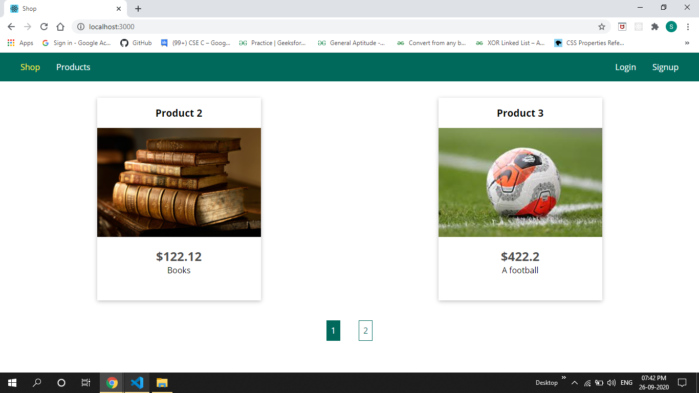
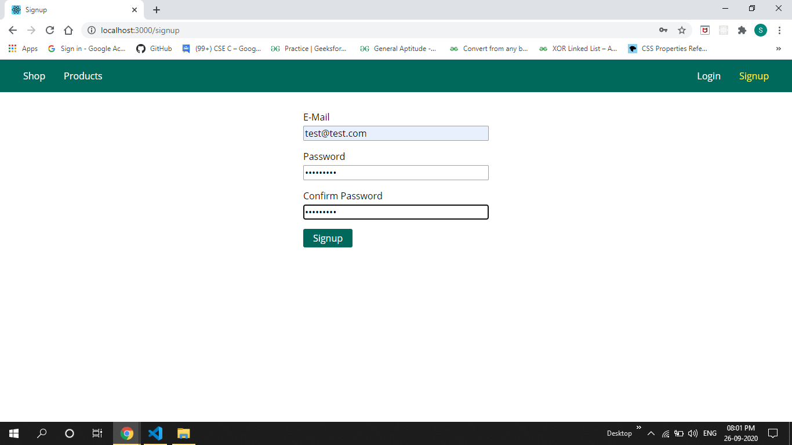
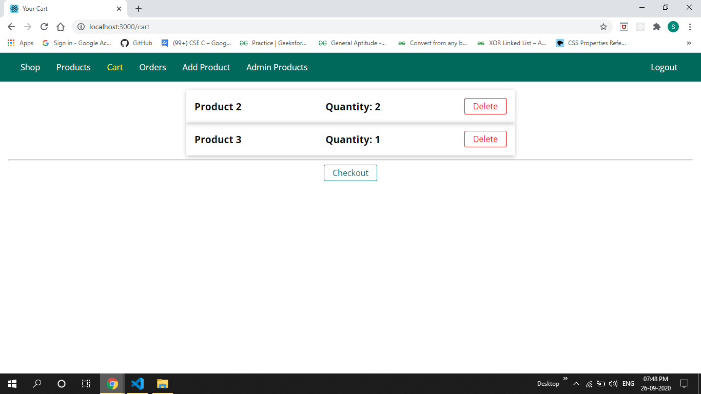
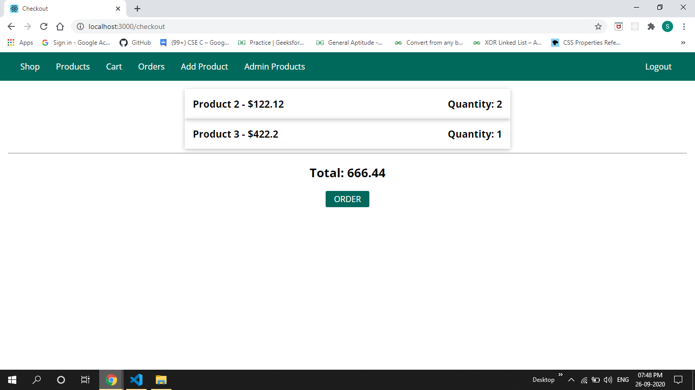
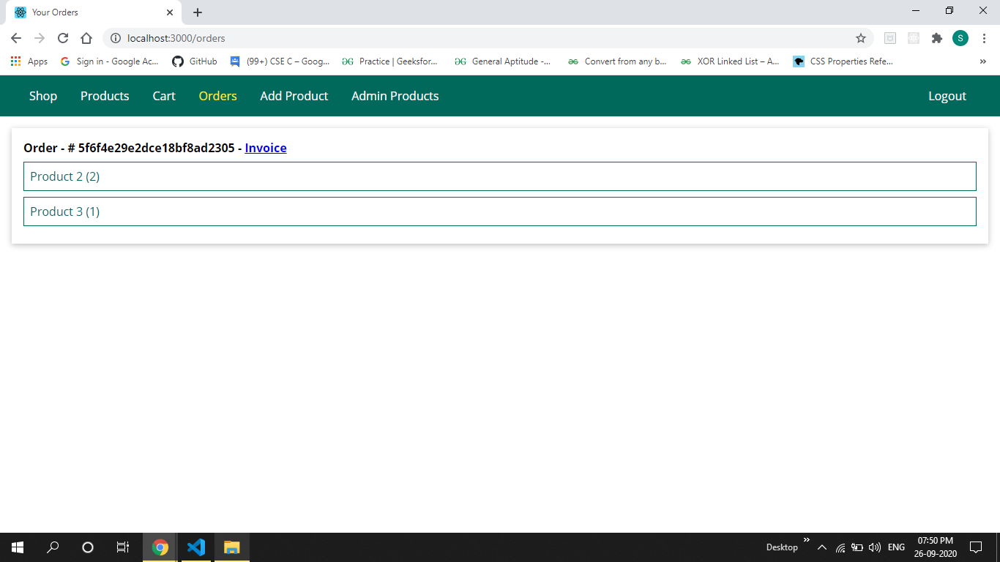
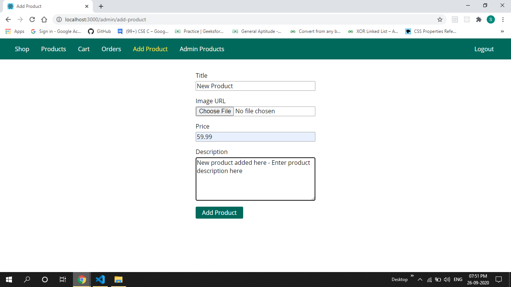

This is an <b>Online shopping website</b> project.
<b>NodeJS</b> is used for backend and <b>Mongodb</b> is used for data storage. This project includes features like <b>pagination</b>,<b>image upload</b>,<b>invoice generation</b> using <b>pdfkit</b>,etc.
<b>EJS Templating</b> is used for rendering the views dynamically.

<h2>Start Screen</h2>

<h2>Login/Signup</h2>

<h2>Cart</h2>

<h2>Checkout</h2>

<h2>Orders</h2>

<h2>Add Products</h2>

